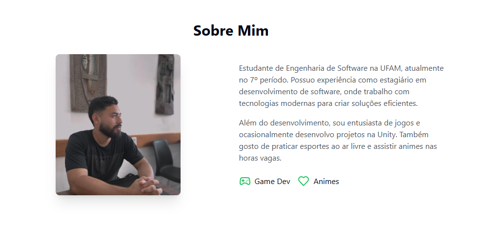

# 🖥️ portfolio-main

📍 **Acesse online:** [https://rennan-alves.com/](https://rennan-alves.com/)

Um portfólio desenvolvido em **React** para apresentar meus projetos, habilidades e trajetória como desenvolvedor de software. O objetivo deste projeto é demonstrar minha capacidade de construir aplicações web modernas, responsivas e de alta qualidade.

## ✨ Funcionalidades

- Seção "Sobre Mim" com informações pessoais e interesses
- Listagem de projetos com descrição e links diretos para repositórios
- Layout responsivo para diferentes dispositivos
- Animações suaves utilizando **Framer Motion**
- Ícones personalizados com **Lucide**

## 🖼️ Interface

A interface do portfólio foi construída com foco em clareza e organização. Os principais elementos incluem:

- Foto de perfil e descrição pessoal
- Ícones representando hobbies e áreas de interesse
- Cards de projetos com imagens, descrições e links
- Estilização moderna com **Tailwind CSS** e **Shadcn/UI**



## 🚀 Tecnologias Utilizadas

- [React](https://react.dev)
- [Framer Motion](https://www.framer.com/motion/)
- [Lucide React](https://lucide.dev/)
- [Tailwind CSS](https://tailwindcss.com)
- [Shadcn/UI](https://ui.shadcn.com/)

### ✅ Requisitos

- [Node.js](https://nodejs.org/) versão 16 ou superior
- [npm](https://www.npmjs.com/) ou [yarn](https://yarnpkg.com/)

## 📦 Como rodar localmente

1. Clone o repositório:

```bash
https://github.com/rennan-dev/portfolio-main.git
cd portfolio-main
```

2. Instale as dependências:

```bash
npm install
```

3. Rode o projeto:

```
npm run dev
```

4. Acesse http://localhost:3000

## 🎯 Objetivo
Este projeto foi desenvolvido para servir como meu portfólio online e demonstrar minha capacidade como desenvolvedor de software. Aqui você encontra uma seleção dos meus principais projetos e habilidades técnicas, apresentados de forma clara e acessível.

## 📄 Licença
Este projeto está licenciado sob os termos da [Licença MIT](./LICENSE).
